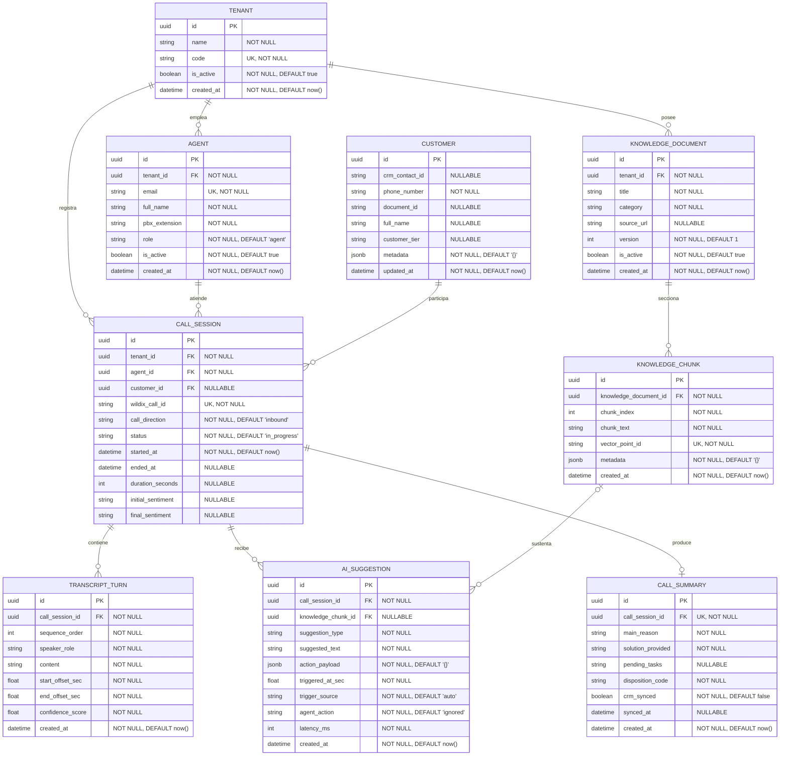

## Índice

0. [Ficha del proyecto](#0-ficha-del-proyecto)
1. [Descripción general del producto](#1-descripción-general-del-producto)
2. [Arquitectura del sistema](#2-arquitectura-del-sistema)
3. [Modelo de datos](#3-modelo-de-datos)
4. [Especificación de la API](#4-especificación-de-la-api)
5. [Historias de usuario](#5-historias-de-usuario)
6. [Tickets de trabajo](#6-tickets-de-trabajo)
7. [Pull requests](#7-pull-requests)

---

## 0. Ficha del proyecto

### **0.1. Tu nombre completo:**
Daniel Pizarro Bustamante

### **0.2. Nombre del proyecto:**
Copiloto VoiceAssist para Wildix

### **0.3. Descripción breve del proyecto:**
Copiloto inteligente en tiempo real para agentes de call center basado en una extensión de navegador. Captura el audio estéreo de llamadas entrantes en webphones (como Wildix Collaboration), transcribe la conversación en tiempo real e interactúa con el CRM y la base de conocimiento para sugerir respuestas inmediatas, identificar al cliente, alertar sobre el tono emocional y automatizar el registro post-llamada sin alterar la infraestructura PBX.

### **0.4. URL del proyecto:**

> Puede ser pública o privada, en cuyo caso deberás compartir los accesos de manera segura. Puedes enviarlos a [alvaro@lidr.co](mailto:alvaro@lidr.co) usando algún servicio como [onetimesecret](https://onetimesecret.com/).

### 0.5. URL o archivo comprimido del repositorio

> Puedes tenerlo alojado en público o en privado, en cuyo caso deberás compartir los accesos de manera segura. Puedes enviarlos a [alvaro@lidr.co](mailto:alvaro@lidr.co) usando algún servicio como [onetimesecret](https://onetimesecret.com/). También puedes compartir por correo un archivo zip con el contenido


---

## 1. Descripción general del producto

> Describe en detalle los siguientes aspectos del producto:

### **1.1. Objetivo:**

Propósito y valor: Reducir los tiempos de atención (AHT), eliminar la sobrecarga cognitiva del operador y elevar la resolución en primer contacto (FCR) en centros de soporte y ventas.

Qué soluciona: Resuelve la fragmentación operativa donde el agente debe escuchar al cliente, navegar por múltiples pestañas del CRM, buscar manuales de procedimientos y redactar notas manuales al colgar.

Para quién: Diseñado para agentes de atención al cliente y ventas que operan con softphones web (específicamente Wildix Collaboration o soluciones WebRTC en navegador), así como para supervisores y áreas de calidad y compliance.

### **1.2. Características y funcionalidades principales:**

1. **Captura y Streaming de Audio Estéreo (Client-Side):**
* Captura en simultáneo el canal del cliente (`chrome.tabCapture`) y el micrófono del agente (`getUserMedia`) sin mezclarlos en mono.
* Envía ambos flujos de audio en crudo a través de un WebSocket continuo hacia el motor de procesamiento.


2. **Transcripción en Streaming de Ultra Baja Latencia:**
* Conversión continua de voz a texto (STT) con discriminación exacta de hablante (*speaker separation* nativa por canal de audio).
* Detección de pausas (*endpointing*) para segmentar turnos conversacionales en menos de 500 ms.


3. **Identificación Automática del Cliente (Zero-Click CRM Lookup):**
* Extracción de entidades clave (DNI, RUC, número telefónico o código de cliente) en los primeros segundos de la llamada.
* Consulta directa al API del CRM para desplegar una tarjeta con el perfil, antigüedad, últimas compras y tickets abiertos del llamante.


4. **Recomendación Contextual y Base de Conocimiento (RAG):**
* Detección de la consulta o reclamo del cliente y búsqueda instantánea en las políticas y manuales de la empresa.
* Entrega de respuestas concisas (en 2 o 3 viñetas procesables) y sugerencias paso a paso.


5. **Disparador Asistido / Botón de Acción Rápida (Trigger Híbrido):**
* Atajo en pantalla o teclado (`Espacio` o botón flotante) para que el operador solicite activamente la respuesta de la IA cuando el cliente plantea una consulta compleja o ambigua.


6. **Semáforo Emocional y Tips de Empatía:**
* Detección de sentimiento (Calmado, Dudoso, Frustrado, Hostil) para guiar al agente con consejos rápidos de desescalamiento.


7. **Resumen y Tipificación Post-Llamada (Auto ACW):**
* Al detectar el colgado de la llamada, la IA genera un resumen estructurado (Motivo, Problema, Solución acordada, Siguiente acción) y actualiza automáticamente el ticket en el CRM.

---
### **1.3. Diseño y experiencia de usuario:**

* **Punto de contacto y activación:**
El sistema se integra como una barra lateral (*side-panel*) no intrusiva sobre la pestaña de Wildix Collaboration / CRM. No requiere pantallas adicionales ni cambios de ventana.
* **Flujo del usuario paso a paso:**
1. **Inicio de llamada:** El agente atiende en su softphone web. La extensión detecta el canal activo y abre el panel lateral automáticamente.
2. **Identificación (0–15 s):** El cliente menciona su documento/identificador; el panel muestra la tarjeta de datos del cliente (nombre, segmento, estado de cuenta).
3. **Durante la llamada:** A medida que surgen dudas técnicas o comerciales, aparecen tarjetas de recomendación con respuestas directas y botones de "Copiar respuesta" o "Marcar resuelto".
4. **Fin de llamada:** Al colgar, aparece una tarjeta con el borrador del resumen de la llamada y un botón para confirmar el guardado en el CRM con un solo clic.


### **1.4. Instrucciones de instalación:**
> Documenta de manera precisa las instrucciones para instalar y poner en marcha el proyecto en local (librerías, backend, frontend, servidor, base de datos, migraciones y semillas de datos, etc.)

---

## 2. Arquitectura del Sistema

### 2.1. Diagrama de arquitectura

```
  ┌────────────────────────────────────────────────────────────────────────┐
  │                 CLIENTE / NAVEGADOR (PUESTO DE AGENTE)                 │
  │                                                                        │
  │   ┌───────────────────────────┐         ┌──────────────────────────┐   │
  │   │  Wildix Collaboration Tab │         │  Side Panel UI (React)   │   │
  │   │  (WebRTC Audio In/Out)    │         │  - Ficha CRM             │   │
  │   └─────────────┬─────────────┘         │  - Tarjetas de Sugerencia│   │
  │                 │                       │  - Alerta Emocional      │   │
  │                 ▼                       └────────────▲─────────────┘   │
  │   ┌───────────────────────────┐                      │                 │
  │   │ Background / Offscreen    │                      │ Push Eventos    │
  │   │ - tabCapture (Cliente)    │                      │ (UI State)      │
  │   │ - getUserMedia (Agente)   │                      │                 │
  │   │ - Web Audio API (Estéreo) │                      │                 │
  │   └─────────────┬─────────────┘                      │                 │
  └─────────────────┼────────────────────────────────────┼─────────────────┘
                    │                                    │
                    │ PCM Audio Stream (Dual-Channel)    │ WebSocket (JSON)
                    ▼                                    │
  ┌──────────────────────────────────────────────────────┴─────────────────┐
  │                  BACKEND ORCHESTRATOR (NODE.JS / FASTIFY)              │
  │                                                                        │
  │  ┌─────────────────────────┐               ┌────────────────────────┐  │
  │  │ WebSocket Gateway       │               │ Session & State Manager│  │
  │  │ (Auth, Heartbeat, VAD)  │──────────────►│ (Sliding Context & ID) │  │
  │  └───────────┬─────────────┘               └───────────┬────────────┘  │
  │              │ Audio chunks                            │               │
  │              ▼                                         │ Transcripción │
  │  ┌─────────────────────────┐                           ▼               │
  │  │ STT Streaming Client    │               ┌────────────────────────┐  │
  │  │ (Deepgram Nova-2 /      │──────────────►│ Copilot Engine / LLM   │  │
  │  │  Whisper Streaming)     │ Transcripción │ (NER, Router, Fast LLM)│  │
  │  └─────────────────────────┘               └─────┬────────────┬─────┘  │
  │                                                  │            │        │
  └──────────────────────────────────────────────────┼────────────┼────────┘
                                                     │            │
                           REST API / OAuth2         │            │ Semántico
                                                     ▼            ▼
                                             ┌───────────┐ ┌─────────────┐
                                             │  CRM API  │ │ Vector DB   │
                                             │ (Tickets, │ │ (Qdrant /   │
                                             │  Contact) │ │  Chroma /   │
                                             │           │ │  Manuales)  │
                                             └───────────┘ └─────────────┘

```

#### Patrón Arquitectónico

* **Arquitectura Orientada a Eventos (EDA) + Pipeline Asíncrono de Streaming**: Basado en eventos de audio y mensajes bidireccionales vía WebSockets.
* **Stateful Session per Call**: Cada llamada activa instancia una sesión temporal en memoria que mantiene los últimos *N* turnos de conversación (*sliding window*) y los datos de contexto del cliente recuperados del CRM.

#### Justificación de la Elección

1. **Latencia Sub-Segundo:** Los protocolos HTTP convencionales basados en sondeo (*polling*) o llamadas sincrónicas cliente-servidor degradan la experiencia. WebSockets full-duplex permiten recibir audio continuo y retornar tarjetas de sugerencia en menos de 1.2 segundos tras el fin de turno.
2. **Agnóstico de Telefonía PBX:** Al apoyarse en la captura del navegador (Chrome Extension), no se requiere alterar la infraestructura de PBX/WMS ni exponer puertos SIP/RTP externos.

#### Beneficios Principales

* **Despliegue Cero Fricción en PBX:** Funciona inmediatamente sobre cualquier agente que utilice el cliente web de Wildix.
* **Separación de Hablantes Perfecta:** Al procesar canales independientes (Canal L = Cliente, Canal R = Agente), la transcripción tiene 100% de precisión de hablante sin sobrecoste de diarización de audio.
* **Ahorro de Cómputo:** Las consultas pesadas de RAG y análisis de intención solo se disparan tras detección de pausas (*endpointing*) o mediante disparador asistido del operador.

#### Sacrificios y Déficits (Trade-offs)

* **Consumo de Recursos en Cliente:** Procesar dos flujos de audio con Web Audio API en el navegador del operador añade un ligero consumo de CPU/RAM en la máquina local.
* **Dependencia del Navegador:** Requiere el uso de Google Chrome / Chromium con la extensión corporativa instalada y permisos activos de captura de pestañas y micrófono.

---

### 2.2. Descripción de componentes principales

| Componente | Tecnología | Propósito |
| --- | --- | --- |
| **Capture & Frontend Widget** | Manifest V3, Web Audio API, React 18, TailwindCSS | Extensión de Chrome. Captura y multiplexa el audio estéreo (tab + micro), mantiene la conexión WSS y renderiza las tarjetas de sugerencia y sentimiento en el Side Panel. |
| **Media Gateway & Orchestrator** | Node.js (v20+ LTS) con Fastify y `@fastify/websocket` | Servidor backend asíncrono. Gestiona el ciclo de vida de la conexión WSS, búferes de audio en memoria y la cola de eventos por llamada. |
| **Speech-to-Text (STT)** | Deepgram Nova-2 API (o Whisper Live streaming) | Transcripción de audio a texto continua con latencia < 350 ms, soporte multi-canal nativo y soporte en español con terminología local. |
| **Inference Engine (LLM)** | Google Gemini 1.5 Flash / Claude 3.5 Haiku | Modelo liviano y de baja latencia encargado de: 1) Clasificación de sentimiento, 2) Extracción de identificadores (DNI/Teléfono), 3) Generación de respuestas guiadas y 4) Resumen post-llamada. |
| **Retrieval Augmented Generation (RAG)** | Qdrant / ChromaDB + Text Embeddings | Indexación y búsqueda semántica de manuales operativos, matrices de objeciones y políticas de soporte al cliente. |
| **CRM Connector** | Cliente HTTP Axios / Fastify Integration Module | Capa de abstracción para consultar endpoints REST del CRM (búsqueda por número/documento y persistencia de tickets y tipificaciones). |

---

### 2.3. Descripción de alto nivel del proyecto y estructura de ficheros

El repositorio se organiza bajo una estructura **Monorepo** modular, separando la lógica del cliente (extensión) del orquestador backend:

```text
callsense-ai/
├── apps/
│   ├── extension/               # Extensión de Chrome (Manifest V3)
│   │   ├── public/              # Icons y manifest.json
│   │   ├── src/
│   │   │   ├── background/      # Service Worker (gestión de pestañas y lifecycle)
│   │   │   ├── offscreen/       # Audio Capture Worker (tabCapture + getUserMedia + WebAudio)
│   │   │   ├── sidepanel/       # UI del Agente (React Components, Hooks, State)
│   │   │   └── shared/          # Interfaces TS y contratos de mensajes
│   │   └── package.json
│   │
│   └── orchestrator/            # Backend Node.js / TypeScript
│       ├── src/
│       │   ├── core/            # Gestor de llamadas y sesiones en memoria
│       │   ├── gateway/         # WebSocket handlers y codecs de audio
│       │   ├── services/
│       │   │   ├── stt/         # Cliente de streaming STT (Deepgram/Whisper)
│       │   │   ├── llm/         # Prompts, parsers y llamadas a LLMs
│       │   │   ├── rag/         # Vector DB search y reranking
│       │   │   └── crm/         # Integración REST con CRM
│       │   ├── config/          # Variables de entorno y configuraciones
│       │   └── index.ts         # Punto de entrada Fastify
│       ├── Dockerfile
│       └── package.json
│
├── docs/                        # Diagramas, especificaciones OpenAPI y prompts
├── docker-compose.yml           # Despliegue local (Orchestrator + Vector DB)
└── README.md

```

#### Patrón y Justificación

* **Clean Architecture / Hexagonal (en el backend):** La capa `services` desacopla los proveedores externos (cambiar de Deepgram a Whisper, o de un CRM a otro) sin alterar la lógica de negocio del orquestador en `core`.
* **Offscreen Pattern (en la extensión):** Obligatorio según el estándar Manifest V3 de Chrome para manipular streams de `AudioContext` de manera estable sin que el Service Worker sea suspendido por inactividad.

---

### 2.4. Infraestructura y despliegue

```
                                      ┌──────────────────────────────────────┐
                                      │            CLOUD PROVIDER            │
                                      │                                      │
[Chrome Extensions]                   │   ┌───────────────┐                  │
        │                             │   │ Cloudflare /  │                  │
        │ TLS / WSS                   │   │ Traefik (WAF) │                  │
        ▼                             │   └───────┬───────┘                  │
┌───────────────┐                     │           │ WSS Reverse Proxy        │
│ Load Balancer │─────────────────────┼───────────▼                          │
└───────────────┘                     │   ┌──────────────────────────────┐   │
                                      │   │ Orchestrator Containers      │   │
                                      │   │ (Docker / Google Cloud Run / │   │
                                      │   │  AWS ECS Fargate)            │   │
                                      │   └───────┬──────────────┬───────┘   │
                                      │           │              │           │
                                      │           ▼              ▼           │
                                      │     ┌───────────┐  ┌─────────────┐   │
                                      │     │ Redis     │  │ Qdrant      │   │
                                      │     │ (Shared   │  │ (Vector DB) │   │
                                      │     │  Session) │  └─────────────┘   │
                                      │     └───────────┘                    │
                                      └──────────────────────────────────────┘

```

#### Proceso de Despliegue (CI/CD)

1. **Integración Continua (GitHub Actions):** En cada `push` o `merge` a la rama `main`, se ejecutan linters, chequeos de tipos de TypeScript y tests unitarios.
2. **Empaquetado de la Extensión:** Se compila el bundle de la extensión de Chrome (`pnpm run build`), generando un artefacto `.zip` versionado listo para despliegue manual o distribución en la Chrome Web Store interna/privada.
3. **Contenedorización y Entrega Continua:** El backend se empaqueta en una imagen Docker ligera (Alpine-based Node.js), se escanea con Trivy para detectar vulnerabilidades y se despliega automáticamente en un clúster de contenedores (Cloud Run o ECS Fargate) protegido por terminación TLS.

---

### 2.5. Seguridad

* **Cifrado en Tránsito:** Toda la transmisión de audio y mensajes de señalización se realiza obligatoriamente sobre **WSS (WebSocket Secure)** y llamadas HTTPS cifradas con TLS 1.3.
* **Aislamiento de Permisos en el Navegador:** La extensión opera bajo el principio de mínimo privilegio en su `manifest.json`, solicitando acceso de captura de audio únicamente sobre el origen específico de la pestaña del softphone (Wildix Collaboration) y no sobre la navegación global del usuario.
* **Anonimización y Enmascaramiento de PII:** Implementación de un filtro por expresiones regulares y NER previo a la invocación de LLMs públicos para enmascarar datos de alta sensibilidad como códigos CVV/CVC, claves y números de tarjetas bancarias.
* **Autenticación Basada en Tokens:** El canal WebSocket requiere un JWT (JSON Web Token) de sesión emitido para el agente autenticado, impidiendo accesos no autorizados a las sesiones de llamada y transcripción.
* **Política de Retención de Audio:** El audio procesado en streaming no se almacena en disco en el servidor intermedio; los fragmentos (*chunks*) residen exclusivamente en memoria volátil durante el tiempo de inferencia del STT y son desechados de inmediato.

---

### 2.6. Tests

* **Tests Unitarios (Backend):** Implementados con **Vitest / Jest** sobre los módulos de procesamiento de texto:
* Pruebas de extracción de entidades (validación de expresiones regulares de DNI, teléfono y código de cliente).
* Pruebas de lógica de ventana deslizante (*sliding window*) de turnos conversacionales.


* **Tests de Integración de Audio y WebSocket:**
* Simulación de clientes WebSocket enviando streams de audio PCM sintético pregrabado para verificar que el pipeline procese los mensajes, invoque el mock del STT y retorne el payload JSON esperado en menos de 1 segundo.


* **Tests de Integración con el CRM:**
* Mocks con `msw` (Mock Service Worker) para validar el comportamiento del orquestador ante respuestas exitosas, retrasos de red o errores HTTP 404/500 en las APIs del CRM.


* **Tests de Carga y Concurrencia:**
* Pruebas ejecutadas con herramientas de benchmark de WebSockets (ej. `k6` / `Artillery`) para garantizar la estabilidad del servidor ante 50+ conexiones de audio en streaming simultáneas sin fugas de memoria.
---

## 3. Modelo de Datos

Aquí tienes una versión refinada, exhaustiva y con máxima precisión técnica para la **Sección 3: Modelo de Datos**, modelada para una base de datos relacional robusta (como PostgreSQL) que respalda tanto la analítica en caliente como la auditoría post-llamada, control de calidad (QA) y retroalimentación de IA.

---

# 3. Modelo de Datos

### 3.1. Diagrama del modelo de datos


### 3.2. Descripción de entidades principales

#### 1. Entidad: `TENANT` (Organización / Empresa)

Permite aislar datos en caso de uso multi-cliente o diferentes sedes operativas de un mismo call center.

* **Atributos:**
* `id` (`UUID`, PK): Identificador único global del tenant.
* `name` (`VARCHAR(100)`, NOT NULL): Razón social o nombre descriptivo.
* `code` (`VARCHAR(50)`, NOT NULL, UNIQUE): Slug identificador alfanumérico.
* `is_active` (`BOOLEAN`, NOT NULL, DEFAULT `true`): Estado de suscripción/operatividad.
* `created_at` (`TIMESTAMPTZ`, NOT NULL, DEFAULT `now()`): Fecha y hora de alta.


* **Relaciones:** 1:N con `AGENT`, `KNOWLEDGE_DOCUMENT` y `CALL_SESSION`.

---

#### 2. Entidad: `AGENT` (Agente de Call Center)

Operador humano que interactúa con la extensión de navegador en Wildix.

* **Atributos:**
* `id` (`UUID`, PK): Identificador único del agente.
* `tenant_id` (`UUID`, FK, NOT NULL): Referencia a `TENANT(id)`.
* `email` (`VARCHAR(150)`, NOT NULL, UNIQUE): Correo corporativo del operador.
* `full_name` (`VARCHAR(120)`, NOT NULL): Nombre y apellido del agente.
* `pbx_extension` (`VARCHAR(30)`, NOT NULL): Número de anexo o extensión en Wildix PBX (ej. "4010").
* `role` (`VARCHAR(20)`, NOT NULL, DEFAULT `'agent'`): Nivel de rol (`'agent'`, `'supervisor'`, `'admin'`).
* `is_active` (`BOOLEAN`, NOT NULL, DEFAULT `true`): Permiso de acceso activo al sistema.
* `created_at` (`TIMESTAMPTZ`, NOT NULL, DEFAULT `now()`).


* **Relaciones:** 1:N con `CALL_SESSION`.

---

#### 3. Entidad: `CUSTOMER` (Cliente / Llamante)

Registro del cliente consultado o enriquecido mediante el CRM a través de la llamada.

* **Atributos:**
* `id` (`UUID`, PK): Identificador interno del cliente.
* `crm_contact_id` (`VARCHAR(100)`, NULLABLE): ID foráneo en el CRM del cliente (HubSpot, Salesforce, etc.).
* `phone_number` (`VARCHAR(25)`, NOT NULL): Número telefónico normalizado en formato E.164.
* `document_id` (`VARCHAR(20)`, NULLABLE): DNI, RUC, o documento de identidad extraído de la llamada.
* `full_name` (`VARCHAR(120)`, NULLABLE): Nombre recuperado del CRM o inferido por la IA.
* `customer_tier` (`VARCHAR(50)`, NULLABLE): Clasificación del cliente (ej. `'Standard'`, `'VIP'`, `'Riesgo de Fuga'`).
* `metadata` (`JSONB`, NOT NULL, DEFAULT `'{}'`): Objeto flexible que contiene datos dinámicos devueltos por el CRM (últimos tickets, saldos, productos contratados).
* `updated_at` (`TIMESTAMPTZ`, NOT NULL, DEFAULT `now()`).


* **Relaciones:** 1:N con `CALL_SESSION`.

---

#### 4. Entidad: `CALL_SESSION` (Sesión de Llamada)

Entidad medular que conecta la llamada de telefonía en Wildix con el ciclo de vida del copiloto.

* **Atributos:**
* `id` (`UUID`, PK): Identificador único de la sesión del copiloto.
* `tenant_id` (`UUID`, FK, NOT NULL): Referencia a `TENANT(id)`.
* `agent_id` (`UUID`, FK, NOT NULL): Referencia al operador en `AGENT(id)`.
* `customer_id` (`UUID`, FK, NULLABLE): Referencia a `CUSTOMER(id)` (puede ser nulo si no se logra asociar cliente).
* `wildix_call_id` (`VARCHAR(100)`, NOT NULL, UNIQUE): Identificador nativo SIP/WebRTC (`Call-ID`) de Wildix para reconciliación.
* `call_direction` (`VARCHAR(20)`, NOT NULL, DEFAULT `'inbound'`): Dirección (`'inbound'` o `'outbound'`).
* `status` (`VARCHAR(20)`, NOT NULL, DEFAULT `'in_progress'`): Ciclo de vida (`'in_progress'`, `'completed'`, `'dropped'`, `'error'`).
* `started_at` (`TIMESTAMPTZ`, NOT NULL, DEFAULT `now()`): Marca de inicio de captura del stream.
* `ended_at` (`TIMESTAMPTZ`, NULLABLE): Marca de cierre al colgar.
* `duration_seconds` (`INTEGER`, NULLABLE): Duración total de la llamada en segundos.
* `initial_sentiment` (`VARCHAR(15)`, NULLABLE): Sentimiento detectado en los primeros 60s (`'calm'`, `'frustrated'`, `'angry'`).
* `final_sentiment` (`VARCHAR(15)`, NULLABLE): Sentimiento registrado al concluir el diálogo.


* **Relaciones:**
* 1:N con `TRANSCRIPT_TURN`.
* 1:N con `AI_SUGGESTION`.
* 1:1 con `CALL_SUMMARY`.


---

#### 5. Entidad: `TRANSCRIPT_TURN` (Turno de Diálogo)

Almacena la secuencia cronológica de intervenciones devuelta por el motor STT en streaming.

* **Atributos:**
* `id` (`UUID`, PK): Identificador único del turno.
* `call_session_id` (`UUID`, FK, NOT NULL): Referencia a `CALL_SESSION(id)`.
* `sequence_order` (`INTEGER`, NOT NULL): Número ordinal del turno en la conversación (1, 2, 3...).
* `speaker_role` (`VARCHAR(10)`, NOT NULL): Rol del hablante (`'agent'` para micrófono, `'customer'` para audio de pestaña).
* `content` (`TEXT`, NOT NULL): Transcripción final estabilizada del turno.
* `start_offset_sec` (`DECIMAL(8,3)`, NOT NULL): Segundo en que comenzó a hablar respecto al inicio de la llamada.
* `end_offset_sec` (`DECIMAL(8,3)`, NOT NULL): Segundo en que finalizó la frase.
* `confidence_score` (`DECIMAL(4,3)`, NOT NULL): Nivel de confianza retornado por el STT (0.000 a 1.000).
* `created_at` (`TIMESTAMPTZ`, NOT NULL, DEFAULT `now()`).


* **Restricciones:** Clave compuesta única opcional `(call_session_id, sequence_order)`.

---

#### 6. Entidad: `AI_SUGGESTION` (Recomendación / Tarjeta de Copiloto)

Registra cada tarjeta mostrada en la extensión del agente, evaluando latencia y efectividad.

* **Atributos:**
* `id` (`UUID`, PK): Identificador único de la sugerencia.
* `call_session_id` (`UUID`, FK, NOT NULL): Referencia a `CALL_SESSION(id)`.
* `knowledge_chunk_id` (`UUID`, FK, NULLABLE): Referencia al fragmento RAG usado como base (si aplica).
* `suggestion_type` (`VARCHAR(30)`, NOT NULL): Categoría (`'rag_answer'`, `'sentiment_alert'`, `'compliance_warning'`, `'crm_quick_action'`).
* `suggested_text` (`TEXT`, NOT NULL): Mensaje o viñetas procesables desplegadas al agente.
* `action_payload` (`JSONB`, NOT NULL, DEFAULT `'{}'`): Metadatos adicionales para la UI (enlaces directos, datos a copiar con un clic).
* `triggered_at_sec` (`DECIMAL(8,3)`, NOT NULL): Segundo de la llamada en que se envió la recomendación.
* `trigger_source` (`VARCHAR(20)`, NOT NULL, DEFAULT `'auto'`): Origen (`'auto'` si la detectó el LLM, `'manual'` si el agente presionó el botón de asistencia).
* `agent_action` (`VARCHAR(20)`, NOT NULL, DEFAULT `'ignored'`): Interacción del operador (`'copied'`, `'liked'`, `'disliked'`, `'dismissed'`, `'ignored'`).
* `latency_ms` (`INTEGER`, NOT NULL): Milisegundos transcurridos desde el fin del turno de voz hasta la entrega de la sugerencia en pantalla.
* `created_at` (`TIMESTAMPTZ`, NOT NULL, DEFAULT `now()`).


---

#### 7. Entidad: `CALL_SUMMARY` (Resumen Post-Llamada / ACW)

Resultado del procesamiento tras colgar la llamada para actualizar el CRM.

* **Atributos:**
* `id` (`UUID`, PK): Identificador único del resumen.
* `call_session_id` (`UUID`, FK, NOT NULL, UNIQUE): Relación 1:1 estricta con `CALL_SESSION(id)`.
* `main_reason` (`TEXT`, NOT NULL): Causa de contacto sintetizada en 1 o 2 oraciones.
* `solution_provided` (`TEXT`, NOT NULL): Acciones tomadas o respuesta entregada por el operador.
* `pending_tasks` (`TEXT`, NULLABLE): Compromisos adquiridos o tareas de seguimiento (*follow-ups*).
* `disposition_code` (`VARCHAR(30)`, NOT NULL): Tipificación estandarizada para el CRM (ej. `'soporte_resuelto'`, `'reclamo_escalado'`, `'venta_perdida'`).
* `crm_synced` (`BOOLEAN`, NOT NULL, DEFAULT `false`): Estado de sincronización hacia el CRM.
* `synced_at` (`TIMESTAMPTZ`, NULLABLE): Marca temporal en que la API del CRM aceptó el resumen.
* `created_at` (`TIMESTAMPTZ`, NOT NULL, DEFAULT `now()`).


---

#### 8. Entidad: `KNOWLEDGE_DOCUMENT` (Documento de Base de Conocimiento)

Metadatos del documento maestro (políticas, instructivos, guías de atención).

* **Atributos:**
* `id` (`UUID`, PK): Identificador único del documento.
* `tenant_id` (`UUID`, FK, NOT NULL): Referencia a `TENANT(id)`.
* `title` (`VARCHAR(200)`, NOT NULL): Título legible del procedimiento.
* `category` (`VARCHAR(50)`, NOT NULL): Área (ej. `'Facturación'`, `'Planes'`, `'Soporte'`).
* `source_url` (`VARCHAR(255)`, NULLABLE): Enlace al documento original en Notion, Confluence o SharePoint.
* `version` (`INTEGER`, NOT NULL, DEFAULT `1`): Control de versiones.
* `is_active` (`BOOLEAN`, NOT NULL, DEFAULT `true`): Disponibilidad para indexación semántica.
* `created_at` (`TIMESTAMPTZ`, NOT NULL, DEFAULT `now()`).


* **Relaciones:** 1:N con `KNOWLEDGE_CHUNK`.

---

#### 9. Entidad: `KNOWLEDGE_CHUNK` (Fragmento de Conocimiento / RAG)

Segmentos de texto extraídos del documento maestro e indexados vectorialmente.

* **Atributos:**
* `id` (`UUID`, PK): Identificador único del fragmento.
* `knowledge_document_id` (`UUID`, FK, NOT NULL): Referencia a `KNOWLEDGE_DOCUMENT(id)`.
* `chunk_index` (`INTEGER`, NOT NULL): Posición secuencial del fragmento dentro del documento.
* `chunk_text` (`TEXT`, NOT NULL): Texto plano procesado para el contexto del LLM.
* `vector_point_id` (`VARCHAR(100)`, NOT NULL, UNIQUE): Identificador del vector en la base de datos vectorial (Qdrant/Chroma).
* `metadata` (`JSONB`, NOT NULL, DEFAULT `'{}'`): Etiquetas semánticas para filtros híbridos.
* `created_at` (`TIMESTAMPTZ`, NOT NULL, DEFAULT `now()`).


* **Relaciones:** 1:N opcional con `AI_SUGGESTION` (Trazabilidad estricta de qué fragmento originó cada sugerencia).
---

## 4. Especificación de la API

```yaml
openapi: 3.0.3
info:
  title: CallSense AI - Copilot Orchestrator API
  version: 1.0.0
  description: >
    API REST para la autenticación de operadores, invocación asistida de 
    conocimiento contextual (RAG) y consolidación post-llamada (ACW) hacia el CRM.
servers:
  - url: https://api.callsense.local/v1
    description: Servidor de desarrollo / pruebas

paths:
  /auth/login:
    post:
      summary: Autenticar agente de call center
      operationId: loginAgent
      description: Valida las credenciales del operador corporativo y emite un token JWT con vigencia de turno para autenticar tanto peticiones HTTP como el canal de streaming WebSocket.
      requestBody:
        required: true
        content:
          application/json:
            schema:
              type: object
              required:
                - email
                - password
              properties:
                email:
                  type: string
                  format: email
                  example: daniel.pizarro@empresa.com
                password:
                  type: string
                  format: password
                  example: PasswordSeguro123!
      responses:
        '200':
          description: Autenticación satisfactoria
          content:
            application/json:
              schema:
                type: object
                required:
                  - token
                  - token_type
                  - expires_in
                  - agent
                properties:
                  token:
                    type: string
                    example: eyJhbGciOiJIUzI1NiIsInR5cCI6IkpXVCJ9.eyJzdWIiOiIxMmU0...
                  token_type:
                    type: string
                    example: Bearer
                  expires_in:
                    type: integer
                    description: Segundos de vigencia
                    example: 28800
                  agent:
                    type: object
                    required:
                      - id
                      - full_name
                      - pbx_extension
                      - tenant_code
                    properties:
                      id:
                        type: string
                        format: uuid
                        example: 3fa85f64-5717-4562-b3fc-2c963f66afa6
                      full_name:
                        type: string
                        example: Daniel Pizarro
                      pbx_extension:
                        type: string
                        example: "4010"
                      tenant_code:
                        type: string
                        example: ccl_contact_center
        '401':
          description: Credenciales inválidas
          content:
            application/json:
              schema:
                $ref: '#/components/schemas/ErrorResponse'

  /calls/{sessionId}/assist:
    post:
      summary: Forzar consulta asistida a la base de conocimiento (RAG Trigger)
      operationId: triggerAssistance
      description: Permite al operador disparar manualmente una consulta a la base de conocimiento usando el contexto acumulado de la llamada activa o un texto específico provisto mediante atajo de teclado.
      security:
        - BearerAuth: []
      parameters:
        - name: sessionId
          in: path
          required: true
          description: UUID de la sesión de llamada activa
          schema:
            type: string
            format: uuid
            example: 7b84f3df-b46f-4424-a74e-7b7da7a19280
      requestBody:
        required: false
        content:
          application/json:
            schema:
              type: object
              properties:
                custom_query:
                  type: string
                  description: Pregunta específica del operador o refinamiento del último turno
                  example: ¿Cuál es el procedimiento para exonerar penalidad por corte fortuito?
      responses:
        '200':
          description: Recomendación generada exitosamente
          content:
            application/json:
              schema:
                type: object
                required:
                  - suggestion_id
                  - call_session_id
                  - suggestion_type
                  - suggested_text
                  - bullet_points
                  - sources
                  - latency_ms
                properties:
                  suggestion_id:
                    type: string
                    format: uuid
                    example: 9c8b7a6d-5e4f-3a2b-1c0d-ef9a8b7c6d5e
                  call_session_id:
                    type: string
                    format: uuid
                    example: 7b84f3df-b46f-4424-a74e-7b7da7a19280
                  suggestion_type:
                    type: string
                    example: rag_answer
                  suggested_text:
                    type: string
                    example: Si el corte fue imprevisto y duró más de 4 horas, aplica compensación total sin penalidad contractual.
                  bullet_points:
                    type: array
                    items:
                      type: string
                    example:
                      - Solicitar el número de ticket de incidencia técnica previa.
                      - Validar que el corte supere las 4 horas continuas según sistema de red.
                      - Aplicar tipificación 'Exoneración_Incidencia_Masiva' en CRM.
                  sources:
                    type: array
                    items:
                      type: string
                    example:
                      - Politica_Compensaciones_SLA_2026.pdf (Cap. 3, Art. 12)
                  latency_ms:
                    type: integer
                    example: 640
        '404':
          description: Sesión de llamada no encontrada
          content:
            application/json:
              schema:
                $ref: '#/components/schemas/ErrorResponse'

  /calls/{sessionId}/summary:
    post:
      summary: Generar y sincronizar resumen post-llamada (After Call Work)
      operationId: completeCallSummary
      description: Cierra formalmente la sesión de llamada, consolida la transcripción con el LLM, categoriza el contacto y sincroniza el ticket en el CRM empresarial.
      security:
        - BearerAuth: []
      parameters:
        - name: sessionId
          in: path
          required: true
          description: UUID de la sesión de llamada a cerrar
          schema:
            type: string
            format: uuid
            example: 7b84f3df-b46f-4424-a74e-7b7da7a19280
      requestBody:
        required: false
        content:
          application/json:
            schema:
              type: object
              properties:
                disposition_override:
                  type: string
                  description: Código de tipificación ajustado manualmente por el operador
                  example: soporte_tecnico_resuelto
                agent_notes:
                  type: string
                  description: Observaciones adicionales del operador
                  example: El cliente quedó conforme con la nota de crédito aplicada.
      responses:
        '200':
          description: Resumen generado y persistido en CRM
          content:
            application/json:
              schema:
                type: object
                required:
                  - summary_id
                  - call_session_id
                  - main_reason
                  - solution_provided
                  - pending_tasks
                  - disposition_code
                  - overall_sentiment
                  - crm_synced
                  - synced_at
                properties:
                  summary_id:
                    type: string
                    format: uuid
                    example: 1e2d3c4b-5a6f-7e8d-9c0b-1a2b3c4d5e6f
                  call_session_id:
                    type: string
                    format: uuid
                    example: 7b84f3df-b46f-4424-a74e-7b7da7a19280
                  main_reason:
                    type: string
                    example: Reclamo por cobro de penalidad no reconocida tras corte de servicio.
                  solution_provided:
                    type: string
                    example: Se verificó la interrupción en el sistema central y se exoneró la penalidad de USD 25.
                  pending_tasks:
                    type: string
                    nullable: true
                    example: Enviar comprobante de ajuste por correo electrónico dentro de las 24 horas.
                  disposition_code:
                    type: string
                    example: reclamo_facturacion_exonerado
                  overall_sentiment:
                    type: string
                    enum: [positive, neutral, negative]
                    example: positive
                  crm_synced:
                    type: boolean
                    example: true
                  synced_at:
                    type: string
                    format: date-time
                    example: 2026-09-23T20:15:30Z

components:
  securitySchemes:
    BearerAuth:
      type: http
      scheme: bearer
      bearerFormat: JWT

  schemas:
    ErrorResponse:
      type: object
      required:
        - error
        - message
      properties:
        error:
          type: string
          example: NOT_FOUND
        message:
          type: string
          example: La sesión de llamada solicitada no existe o ya ha sido finalizada.

```

---

## 5. Historias de Usuario

# Backlog Inicial del MVP: CallSense AI (Fase 1)

---

## Épica 1: Captura y Transmisión de Audio Estéreo en Tiempo Real

### Historia de usuario 1.1: Captura de canales de audio independientes

Como agente de call center, quiero que la extensión capture de forma simultánea el audio de la llamada del cliente y mi propio micrófono sin mezclarlos, para que el sistema procese a cada interlocutor en un canal independiente.

#### Criterios de aceptación (Given/When/Then):

* **Given** que el agente tiene una llamada en curso en la pestaña del softphone web (Wildix Collaboration),
**When** se activa la captura de audio mediante la extensión,
**Then** el sistema captura la voz del cliente a través del audio de la pestaña y la voz del agente a través del micrófono en dos canales estéreo separados.
* **Given** que la captura de audio de la pestaña está activa,
**When** el cliente habla durante la llamada,
**Then** el agente continúa escuchando el audio del cliente en sus auriculares sin interrupciones ni distorsiones audibles.
* **Given** que la llamada finaliza y se detecta el evento de colgado,
**When** el softphone cierra el canal de voz,
**Then** la extensión detiene automáticamente la captura del micrófono y del audio de la pestaña.

---

### Historia de usuario 1.2: Streaming y transcripción continua con separación de hablantes

Como agente de call center, quiero que la conversación se transcriba continuamente y se asigne a cada interlocutor, para que las intervenciones de voz se conviertan en texto en tiempo real.

#### Criterios de aceptación (Given/When/Then):

* **Given** que los dos canales de audio están siendo capturados,
**When** se envían los flujos de audio al servicio de procesamiento,
**Then** la transcripción de voz a texto se genera de forma continua discriminando de forma unívoca si la intervención corresponde al cliente o al agente.
* **Given** que uno de los interlocutores está hablando,
**When** hace una pausa de voz (endpointing),
**Then** el turno conversacional se segmenta y su transcripción final se estabiliza en menos de 500 ms.
* **Given** que ambos interlocutores hablan simultáneamente,
**When** se procesa el audio estéreo,
**Then** el sistema genera los textos transcritos de ambos canales sin cruzar ni sobreescribir los textos de los hablantes.

---

## Épica 2: Identificación Automática del Cliente y Contexto CRM

### Historia de usuario 2.1: Identificación por documento o teléfono (Zero-Click)

Como agente de call center, quiero que el sistema reconozca el identificador del cliente durante la llamada y consulte el CRM sin que deba digitarlo, para acceder inmediatamente a su información sin cambiar de pantalla.

#### Criterios de aceptación (Given/When/Then):

* **Given** que la llamada ha iniciado y el cliente vocaliza su DNI, RUC o número de teléfono,
**When** el sistema detecta y extrae la entidad numérica de la transcripción,
**Then** realiza automáticamente la consulta vía API al CRM con dicho identificador sin requerir intervención manual del agente.
* **Given** que el CRM devuelve un registro coincidente con el identificador detectado,
**When** se recibe la respuesta de la API,
**Then** la interfaz lateral muestra una tarjeta con el nombre del cliente, segmento/antigüedad, últimas compras y tickets abiertos.
* **Given** que el identificador extraído no existe en el CRM o no devuelve coincidencias,
**When** la API del CRM responde con un resultado vacío,
**Then** el sistema presenta un aviso discreto indicando que el cliente no fue identificado y habilita un campo de búsqueda manual.

---

## Épica 3: Recomendaciones Contextuales y Consulta de Conocimiento (RAG)

### Historia de usuario 3.1: Detección automática de consultas y sugerencia de respuestas

Como agente de soporte (asumido), quiero visualizar sugerencias basadas en las políticas y manuales de la empresa cuando el cliente haga una consulta, para entregar la solución adecuada de manera rápida.

#### Criterios de aceptación (Given/When/Then):

* **Given** que el cliente realiza una pregunta o manifiesta un reclamo sobre un producto o servicio,
**When** el sistema detecta la intención en la transcripción,
**Then** realiza una búsqueda en la base de conocimiento y despliega en el panel una tarjeta de recomendación en formato de viñetas cortas (2 a 3 líneas).
* **Given** que el sistema entrega una recomendación basada en la base de conocimiento,
**When** la tarjeta se dibuja en la pantalla del agente,
**Then** muestra la respuesta procesable y cita el título o sección del manual del cual se extrajo la información.
* **Given** que una tarjeta de recomendación está visible en el panel,
**When** el agente presiona el botón "Copiar respuesta",
**Then** el texto de la recomendación se transfiere al portapapeles del puesto de trabajo.

---

### Historia de usuario 3.2: Disparo asistido de consulta mediante botón de acción rápida

Como agente de call center, quiero activar manualmente una búsqueda en la base de conocimiento mediante un atajo o botón, para forzar una recomendación cuando la consulta del cliente sea confusa o ambigua.

#### Criterios de aceptación (Given/When/Then):

* **Given** que una conversación está en curso y el cliente plantea una consulta compleja,
**When** el agente presiona la tecla de acceso rápido configurada (tecla Espacio o F2) o el botón en pantalla,
**Then** el sistema procesa el contexto conversacional inmediato y dispara la búsqueda de la solución en la base de conocimiento.
* **Given** que el agente activó la búsqueda manual,
**When** el modelo resuelve la consulta,
**Then** la tarjeta de respuesta se despliega en el panel lateral marcada visualmente como resultado de solicitud manual (asumido).
* **Given** que la base de conocimiento no contiene una coincidencia relevante para la consulta forzada,
**When** culmina la búsqueda,
**Then** el panel notifica al operador que no se encontró una respuesta exacta en los manuales disponibles.

---

## Épica 4: Guía de Cumplimiento y Calidad

### Historia de usuario 4.1: Checklist dinámico de cumplimiento normativo y calidad

Como supervisor de calidad y compliance (asumido), quiero que el sistema verifique automáticamente los descargos legales y pasos obligatorios durante la llamada, para asegurar que los agentes cumplan con el protocolo establecido.

#### Criterios de aceptación (Given/When/Then):

* **Given** que una llamada está en curso y se requiere realizar el saludo inicial formal y el aviso de grabación,
**When** el agente pronuncia la frase reglamentaria en su canal de micrófono,
**Then** el ítem correspondiente dentro del checklist de compliance se marca como completado automáticamente.
* **Given** que una llamada requiere la lectura de un descargo legal o cláusula obligatoria antes de finalizar,
**When** la llamada avanza sin que el agente haya leído dicha cláusula,
**Then** el ítem del checklist permanece en estado pendiente alertando visualmente al operador.
* **Given** que la llamada finaliza,
**When** el sistema compila los datos de la sesión,
**Then** registra el estado final de cada punto del checklist de cumplimiento (completado o no completado) asociado al registro de la llamada.

---

## Épica 5: Resumen y Cierre Post-Llamada (After Call Work)

### Historia de usuario 5.1: Generación y sincronización automática del resumen post-llamada

Como agente de call center, quiero que el sistema redacte un resumen estructurado y la tipificación al colgar, para evitar redactar notas manuales y actualizar el CRM con un solo clic.

#### Criterios de aceptación (Given/When/Then):

* **Given** que una llamada ha estado activa con transcripción generada,
**When** se detecta el evento de término de llamada (hangup),
**Then** el sistema presenta en el panel un borrador de resumen estructurado que incluye motivo de contacto, problema, solución acordada y siguiente acción.
* **Given** que el resumen estructurado ha sido generado,
**When** el agente revisa el texto,
**Then** puede editar directamente el contenido de los campos de notas y tipificación antes de enviarlo.
* **Given** que el agente valida el resumen y la tipificación sugerida,
**When** hace clic en el botón de confirmación de guardado,
**Then** el sistema envía la información vía API al CRM, actualiza el ticket correspondiente y notifica en pantalla la confirmación exitosa de sincronización.

---

## 6. Tickets de Trabajo

# 6. Tickets de Trabajo

---

## Ticket 1: Backend & Orquestación

### Metadatos

* **ID:** `BACK-101`
* **Título:** Ingesta de audio dual-channel vía WebSocket y relay en streaming a Deepgram Nova-2
* **Tipo:** Tarea de Desarrollo / Backend
* **Componente:** `apps/orchestrator`
* **Prioridad:** Alta (Bloqueante para el pipeline de IA)

---

### Descripción del Requerimiento

Implementar un endpoint WebSocket en el servidor Fastify (`/ws/audio-stream/:sessionId`) que reciba paquetes binarios de audio PCM (16-bit, 16 kHz, estéreo/dual-channel) provenientes de la extensión del navegador. El backend debe desempaquetar el flujo y enviarlo de forma continua a la API de streaming de Deepgram (modelo Nova-2 multicanal en español), capturar los eventos de transcripción estabilizada (`is_final: true`) y publicarlos en el bus de eventos interno desacoplado (`EventBus`) para la orquestación de RAG y CRM.

---

### Especificación Técnica de Implementación

1. **Ruta y Autenticación:**
* Crear el handler con `@fastify/websocket` en `src/gateway/audioStreamSocket.ts`.
* Extraer el parámetro `sessionId` de la URL y validar el token JWT provisto en la query string (`?token=...`). Rechazar con código de cierre WebSocket `1008 (Policy Violation)` si es inválido o expiró.


2. **Conexión de Salida a STT:**
* Utilizar `@deepgram/sdk` configurado para streaming en tiempo real:
* `model: "nova-2"`
* `language: "es"`
* `punctuate: true`
* `interim_results: false` (solo finales para el MVP)
* `multichannel: true` (Canal 0 = Cliente, Canal 1 = Agente)
* `endpointing: 300` (detección de silencio en 300 ms)


3. **Flujo de Datos:**
* Cada fragmento binario (`Buffer`) recibido por el socket del cliente se reenvía sin alteraciones al socket de Deepgram (`deepgramLive.send(chunk)`).
* Al recibir el evento `TranscriptReceived` de Deepgram:
* Mapear `channel_index: 0` a `speaker: 'customer'` y `channel_index: 1` a `speaker: 'agent'`.
* Extraer `transcript`, `start`, `duration` y `confidence`.
* Emitir el evento de dominio `TRANSCRIPT_TURN_COMPLETED` hacia el orquestador en memoria.


4. **Ciclo de Vida y Limpieza:**
* Ante desconexión del cliente (`socket.on('close')`), llamar a `deepgramLive.finish()`, limpiar los listeners y cerrar la sesión en memoria para evitar fugas de sockets abiertos.


---

### Criterios de Aceptación (Definición de Terminado)

* [ ] Conexión WebSocket funcional y protegida por JWT en `/ws/audio-stream/:sessionId`.
* [ ] Latencia de transcripción final devuelta menor o igual a 450 ms desde que el cliente deja de hablar (medido con métricas de performance).
* [ ] Discriminación unívoca de hablantes: el texto del Canal 0 siempre se etiqueta como `customer` y el Canal 1 como `agent`.
* [ ] Cobertura de pruebas unitarias superior al 80% sobre los adaptadores de parseo de audio y mapeo de eventos.
* [ ] No existen fugas de sockets huérfanos tras desconexión forzada del cliente (probado con 50 aperturas/cierres abruptos).

---

### Plan de Pruebas y Validación

1. **Prueba Unitaria:**
* Crear mock del SDK de Deepgram con Vitest.
* Inyectar payloads de prueba y comprobar que el mapper asigne correctamente `speaker` según el canal.


2. **Prueba de Integración Local:**
* Ejecutar un script Node.js cliente (`test/mocks/sendAudioFile.ts`) que lea un archivo `.wav` estéreo de 16-bit/16 kHz y lo transmita en chunks de 20 ms cada 20 ms.
* Validar en la consola del backend que se impriman los turnos transcritos con formato JSON válido.


---

## Ticket 2: Frontend & Extensión de Navegador

### Metadatos

* **ID:** `FRONT-201`
* **Título:** Captura de audio Offscreen (Pestaña + Micro) y Panel Lateral React para sugerencias
* **Tipo:** Tarea de Desarrollo / Frontend
* **Componente:** `apps/extension`
* **Prioridad:** Alta (Bloqueante para interacción de usuario)

---

### Descripción del Requerimiento

Implementar el ciclo de captura de audio dual en la extensión de Chrome (Manifest V3) empleando un documento *Offscreen* para eludir las restricciones del Service Worker. El documento debe capturar la salida de audio de la pestaña activa de Wildix Collaboration (`chrome.tabCapture`) y el micrófono del agente (`navigator.mediaDevices.getUserMedia`), fusionarlos en un único `MediaStream` estéreo sin cancelar la audición del operador, y transmitirlos por WebSocket al backend. Asimismo, crear la UI del `Side Panel` en React 18 que renderice las tarjetas de recomendación en tiempo real.

---

### Especificación Técnica de Implementación

1. **Documento Offscreen (`src/offscreen/audioCapture.ts`):**
* Crear el documento offscreen desde el Background Service Worker si no existe: `chrome.offscreen.createDocument(...)` con razón `USER_MEDIA`.
* Capturar pestaña: `chrome.tabCapture.getMediaStreamId()` y obtener stream mediante `getUserMedia({ audio: { mandatory: { chromeMediaSource: 'tab', chromeMediaSourceId } } })`.
* Capturar micrófono: `navigator.mediaDevices.getUserMedia({ audio: true })`.
* **Web Audio API:**
* Instanciar `AudioContext` a 16000 Hz.
* Conectar el stream de la pestaña a `audioContext.destination` para que el agente siga escuchando al cliente en sus auriculares.
* Utilizar un `ChannelMergerNode(2)`: Conectar Pestaña al Canal 0 (izquierdo) y Micrófono al Canal 1 (derecho).
* Crear un `ScriptProcessorNode` o `AudioWorkletNode` para convertir las muestras Float32 a Int16 PCM y enviarlas por WebSocket binario.


2. **Interfaz Side Panel (`src/sidepanel/App.tsx`):**
* Conectar por WebSocket secundario JSON para recibir eventos del backend (`SUGGESTION_ADDED`, `SENTIMENT_UPDATED`).
* Componentes:
* `CustomerProfileCard`: Muestra DNI/Teléfono, nombre y tickets previos.
* `SuggestionList`: Tarjetas de 2-3 viñetas con botón "Copiar" que use `navigator.clipboard.writeText`.
* `SentimentBadge`: Indicador discreto (Verde / Ámbar / Rojo).


* Tecla de acceso rápido: Listener global para `keydown` en tecla `Espacio` o `F2` que emita un POST a `/api/v1/calls/:sessionId/assist`.


---

### Criterios de Aceptación (Definición de Terminado)

* [ ] La captura de pestaña no interrumpe el retorno de audio en los auriculares del operador.
* [ ] El WebSocket transmite chunks PCM Int16 a 16 kHz en formato estéreo continuo.
* [ ] El panel lateral de Chrome se abre y renderiza las tarjetas dinámicas sin bloqueos visuales ni re-renderizados innecesarios (`React.memo` en tarjetas de sugerencia).
* [ ] El botón "Copiar" traslada con éxito el texto sugerido al portapapeles y despliega un tooltip de confirmación temporal (2 segundos).
* [ ] El atajo de teclado configurado dispara la petición manual de asistencia sin interferir en los inputs de texto normales.

---

### Plan de Pruebas y Validación

1. **Prueba Funcional en Navegador:**
* Cargar la extensión en `chrome://extensions/` en modo desarrollador.
* Abrir Wildix Collaboration (o YouTube en pestaña de prueba) y reproducir audio mientras se habla por el micrófono.
* Inspeccionar la pestaña offscreen en las herramientas de desarrollo y comprobar que el WebSocket envíe tráfico de subida constante (aprox. 64 KB/s para audio estéreo sin comprimir).


2. **Prueba de Interfaz:**
* Disparar eventos mock desde la consola para renderizar tarjetas de cliente y verificar que el botón "Copiar" funcione.


---

## Ticket 3: Base de Datos & Persistencia

### Metadatos

* **ID:** `DATA-301`
* **Título:** Esquema relacional en PostgreSQL para llamadas, transcripciones y auditoría de IA
* **Tipo:** Tarea de Desarrollo / Base de Datos
* **Componente:** `apps/orchestrator/src/database`
* **Prioridad:** Media-Alta (Base para persistencia de sesiones y analítica)

---

### Descripción del Requerimiento

Diseñar e implementar las migraciones DDL en PostgreSQL para estructurar el modelo de datos relacional de la plataforma. El esquema debe soportar el almacenamiento normalizado de organizaciones (`TENANT`), agentes (`AGENT`), clientes identificados (`CUSTOMER`), sesiones de llamada (`CALL_SESSION`), turnos de transcripción cronológicos (`TRANSCRIPT_TURN`), sugerencias emitidas por el copiloto (`AI_SUGGESTION`), resúmenes post-llamada (`CALL_SUMMARY`) y base documental (`KNOWLEDGE_DOCUMENT`, `KNOWLEDGE_CHUNK`).

---

### Especificación Técnica de Implementación

1. **Definición de Esquema (DDL):**
* Crear migración SQL idempotente usando la herramienta de migraciones del proyecto (Prisma / Kysely / Drizzle).
* Implementar todas las tablas con claves primarias `UUID` autogeneradas mediante `gen_random_uuid()`.
* Configurar tipos estrictos:
* `speaker_role`: `VARCHAR(10)` con CHECK (`speaker_role IN ('agent', 'customer')`).
* `suggestion_type`: `VARCHAR(30)` con CHECK (`suggestion_type IN ('rag_answer', 'sentiment_alert', 'compliance_warning', 'crm_quick_action')`).
* `agent_action`: `VARCHAR(20)` con CHECK (`agent_action IN ('copied', 'liked', 'disliked', 'dismissed', 'ignored')`).


2. **Indexación Estratégica:**
* `CREATE UNIQUE INDEX idx_agent_email ON AGENT(email);`
* `CREATE UNIQUE INDEX idx_call_wildix_id ON CALL_SESSION(wildix_call_id);`
* `CREATE INDEX idx_transcript_call_seq ON TRANSCRIPT_TURN(call_session_id, sequence_order);` (optimiza la recuperación del diálogo en orden cronológico).
* `CREATE INDEX idx_customer_phone ON CUSTOMER(phone_number);` (optimiza el lookup por número llamante).
* `CREATE INDEX idx_suggestion_call ON AI_SUGGESTION(call_session_id);`


3. **Integridad Referencial:**
* Configurar `ON DELETE CASCADE` para `TRANSCRIPT_TURN`, `AI_SUGGESTION` y `CALL_SUMMARY` asociados a una llamada borrada en entornos de prueba.
* `RESTRICT` en eliminación de `TENANT` o `AGENT` si tienen llamadas históricas vinculadas.


4. **Seed de Datos (`prisma/seed.ts` o equivalente):**
* 1 Tenant de prueba (`CCL_DEMO`).
* 2 Agentes con extensiones configuradas (`4010`, `4011`).
* 5 Documentos de base de conocimiento troceados en chunks con IDs de referencia vectorial ficticios.


---

### Criterios de Aceptación (Definición de Terminado)

* [ ] Migraciones ejecutables en sentido ascendente (`up`) y descendente (`down`) sin errores de sintaxis en PostgreSQL 16+.
* [ ] Integridad de tipos y restricciones CHECK operativas ante inserción de valores inválidos (ej. speaker inválido falla inmediatamente).
* [ ] El plan de ejecución (`EXPLAIN ANALYZE`) para la consulta de todos los turnos de transcripción de una sesión ejecuta un Index Scan sobre `idx_transcript_call_seq` en menos de 5 ms con 10,000 registros insertados.
* [ ] Script de seed ejecuta de manera limpia e inserta los datos mínimos necesarios para desarrollo local.

---

### Plan de Pruebas y Validación

1. **Prueba de Migración:**
* Ejecutar en contenedor Docker local:
```bash
docker compose exec postgres psql -U callsense -d callsense_db -c "DROP SCHEMA public CASCADE; CREATE SCHEMA public;"
pnpm db:migrate
pnpm db:seed

```


2. **Prueba de Restricciones (Integridad):**
* Intentar insertar un turno de diálogo con `speaker_role = 'bot'` y confirmar que la base de datos lance error de violación de restricción CHECK.
* Intentar duplicar un `wildix_call_id` y comprobar que se bloquee por índice único.

---

## 7. Pull Requests

> Documenta 3 de las Pull Requests realizadas durante la ejecución del proyecto

**Pull Request 1**

**Pull Request 2**

**Pull Request 3**

